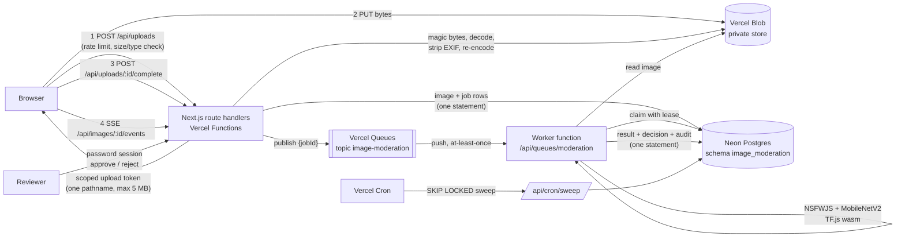

# Intelligent Cloud-Based Image Moderation Platform

Rebuilt from scratch in 2026. The original 2024-25 project code was not preserved.

**Live:** https://image-moderation-platform.vercel.app

Anyone can upload an image. It goes to private object storage, a moderation job is queued, and a worker runs
open-source image classifiers on it. A policy engine with per-category thresholds approves it, rejects it, or sends it
to a human reviewer. The status page updates live as the job moves from queued to processing to decided, and the
public gallery only ever shows approved images.

**Reviewer demo:** open [/review](https://image-moderation-platform.vercel.app/review) and sign in with the password
`moderate-demo-2026`. It is published here on purpose so the demo can be tried; every reviewer action is recorded in
the audit log. To get something into the queue, upload with the **Strict (demo)** policy, which sends every upload
that is not rejected to review.

## Architecture



The original project used S3, Lambda, DynamoDB, Kafka and Kubernetes. There is no AWS or GCP account behind this
rebuild, so it keeps the same event-driven shape on Vercel:

| Concern | Original (2024-25) | This rebuild |
|---|---|---|
| Object storage | S3 | Vercel Blob, private store, direct browser upload with scoped tokens |
| Event stream / queue | Kafka | Vercel Queues (durable topic, push delivery, at-least-once) |
| Compute | Lambda, Kubernetes | Vercel Functions (Node.js, Fluid compute) |
| Metadata | DynamoDB | Neon Postgres, dedicated `image_moderation` schema |

### Job lifecycle

```
queued ──claim──▶ processing ──complete──▶ completed      (image: approved | rejected | needs_review)
                     │  ▲
               fail  │  │ claim after backoff, or reclaim when the lease expires
                     ▼  │
                  retrying ──attempts exhausted──▶ dead_letter   (image: failed)
```

- **Idempotent worker.** A delivery claims the job with a conditional `UPDATE` that sets a 120 s lease and bumps
  `attempts`. A duplicate delivery of a finished job is acknowledged without work; a duplicate that arrives while
  another instance holds the lease is told to retry when the lease ends. The attempt number is a fencing token, so a
  stale worker cannot overwrite the result of the attempt that replaced it.
- **Atomic writes.** Completing a job (store result, set image status, mark job completed, write audit entry) and
  every reviewer action are single SQL statements built from data-modifying CTEs. That keeps them atomic on Neon's
  HTTP driver and lets the same code run on PGlite in tests.
- **Retries and dead letters.** A failed attempt moves to `retrying` with exponential backoff and full jitter (2 s,
  4 s, 8 s, up to 120 s), and the queue redelivery delay follows the same backoff. After 4 attempts the job is
  dead-lettered and the image marked `failed`, so it never silently disappears.
- **Recovery.** If publishing fails after the job row is committed, the status endpoints re-publish jobs that sat in
  `queued` for more than 20 s (a guarded `UPDATE` lets exactly one poller do it). A cron sweeper claims due, retrying
  or abandoned jobs with `FOR UPDATE SKIP LOCKED`, so several sweepers can run at once without double-claiming.
- **Policy engine.** Each policy maps a category to optional `review` and `reject` thresholds. At or above `reject`
  rejects, at or above `review` goes to a human, and reject wins. The policy snapshot and version are stored with
  every result so decisions can be audited later. See [/policies](https://image-moderation-platform.vercel.app/policies).
- **Upload safety.** Type is decided by magic bytes (JPEG, PNG, WebP only), never by name or declared type. The
  5 MB cap is enforced three times: on the declared size, in the Blob token, and on the bytes actually read back.
  Images are decoded with a 40 MP pixel limit, auto-rotated, and re-encoded with all metadata dropped (EXIF, GPS,
  XMP, IPTC). Uploads are rate-limited per IP (30 per 10 minutes, a fixed window in Postgres). IPs are stored only as
  salted hashes.
- **Access control.** The Blob store is private. `/api/images/:id/file` streams approved images to anyone and
  everything else only to a signed-in reviewer. The reviewer login is one shared password from `REVIEWER_PASSWORD`,
  exchanged for an HMAC-signed, expiring, `HttpOnly`, `SameSite=Strict` cookie, and login attempts are rate-limited.

## Stack

- Next.js 16 (App Router) and TypeScript on Vercel Functions (Node.js runtime)
- Vercel Blob (private store) for images
- Vercel Queues (`@vercel/queue`, public beta) for the moderation topic
- Neon Postgres via `@neondatabase/serverless`
- TensorFlow.js 4.22 on the WebAssembly backend, running in the worker function:
  - [NSFWJS](https://github.com/infinitered/nsfwjs) MobileNetV2 (MIT): drawing / hentai / neutral / porn / sexy scores
  - MobileNetV2 1.0 224 ImageNet classifier from TF Hub (Apache 2.0), vendored in `models/`: the general-content label
- sharp for decoding, orientation and metadata stripping
- Vitest and PGlite (in-process Postgres) for tests, Playwright for browser checks, GitHub Actions for CI

## API

| Method | Path | Purpose |
|---|---|---|
| POST | `/api/uploads` | `{size, contentType, policyId?}` reserves an id and returns a one-path Blob upload token |
| POST | `/api/uploads/:id/complete` | Verify, sanitize and store the upload, create and publish the job (202) |
| GET | `/api/images/:id` | Stage, job state, scores, labels, decision reasons |
| GET | `/api/images/:id/events` | Server-Sent Events stream of status changes |
| GET | `/api/images/:id/file` | Image bytes (approved only, or any status for reviewers) |
| GET | `/api/images` | Approved gallery |
| GET | `/api/policies` | Policies and thresholds |
| POST | `/api/queues/moderation` | Vercel Queues push consumer (not called directly) |
| GET | `/api/cron/sweep` | SKIP LOCKED sweeper, requires `CRON_SECRET` |
| POST | `/api/review/login`, `/api/review/logout` | Reviewer session |
| GET | `/api/review/queue` | Items waiting for review (reviewer only) |
| POST | `/api/review/:id` | `{action: "approve" \| "reject", note?}` (reviewer only, audited) |

## Running it

```bash
npm install
npm test                 # unit + integration tests, no external services needed
npm run lint && npm run typecheck
```

To run the app locally you need a Neon database and a Blob store (the linked Vercel project provides both):

```bash
vercel link
vercel env pull .env.local
cp .env.example .env.development.local   # set REVIEWER_PASSWORD, keep QUEUE_DRIVER=inline
npm run db:migrate                        # creates the image_moderation schema
npm run dev
```

With `QUEUE_DRIVER=inline` the worker runs in the same process instead of through Vercel Queues; job state, retries
and dead letters still go through Postgres. On Vercel the consumer is registered in `vercel.json`.

Browser check and latency benchmark against a deployment:

```bash
uv run --with playwright --python 3.12 python e2e/verify.py https://image-moderation-platform.vercel.app photo.jpg
npx tsx scripts/bench-live.ts https://image-moderation-platform.vercel.app ./some-photos 25
npx tsx scripts/eval.ts --picsum ./picsum --imagenette ./imagenette2-160/val --per-class 30
```

## Results

All numbers below were measured on 2026-09-25. Percentiles use the nearest-rank method. Raw data is in `bench/`.

### Tests

45 tests pass (`npm test`, about 1.4 s): policy engine and job state machine unit tests (every state/event pair of
the transition table), magic bytes, size cap, EXIF stripping and orientation, session signing, and an integration
suite that runs the whole upload-to-decision flow on PGlite with the real models. The integration suite covers
approval and gallery visibility, duplicate delivery and duplicate completion, a concurrent duplicate during a live
lease, strict-policy review with the reviewer decision and audit trail, reject thresholds, backoff through to dead
letter, crash recovery by the SKIP LOCKED sweeper, fencing of a stale worker, no double claims across overlapping
sweeper calls (PGlite runs them on one connection, so this checks the query logic rather than lock contention), non-image and oversized uploads, and the per-client rate limit.

### Live end-to-end check (Playwright, production URL)

`e2e/verify.py` against https://image-moderation-platform.vercel.app, unauthenticated:

- `GET /` returned 200.
- A default-policy upload was seen going through `queued`, `processing`, `decided` and reached `approved` in 6.12 s
  (this was the first upload to a fresh deployment, so it includes function cold starts and model loading), and appeared in the gallery.
- A strict-demo upload reached `needs_review` in 1.49 s, was absent from the gallery, and its file URL returned 404.
- `/api/review/queue` returned 401 without a session, a wrong password was refused, and after signing in the flagged
  item was approved with a note. The audit log showed the `review_approve` entry and the image moved to the gallery.

Also checked by hand against production: a shell script uploaded as `image/jpeg` was refused at completion with 415,
a declared 6 MB upload with 413, a declared GIF with 415, the sweeper and review endpoints with 401 without credentials, and
the 31st upload reservation within 10 minutes from one IP with 429 and a `Retry-After` header. Blob itself
refused a 5 MB + 100 byte PUT made with an issued token, and a PUT with `image/gif` as the content type.

### Live moderation latency (25 uploads, production)

`scripts/bench-live.ts`, run from a laptop, 25 sequential uploads of different 800x600 JPEG photos under the default
policy. End-to-end runs from the reservation request until the client sees the decision (status polled every 100 ms).

| Metric | p50 | p95 | max |
|---|---|---|---|
| End-to-end, upload request to decision seen | 1045 ms | 1636 ms | 4153 ms |
| Blob upload from the client | 133 ms | 279 ms | 307 ms |
| Complete (verify, sanitize, store, enqueue) | 395 ms | 828 ms | 913 ms |
| Server: upload committed to worker start (queue delivery) | 188 ms | 617 ms | 658 ms |
| Server: worker start to decision committed | 197 ms | 260 ms | 2040 ms |
| Model inference inside the worker | 133 ms | 170 ms | 230 ms |

The 4153 ms maximum was the first upload, which hit a cold worker (model load included). Decisions: 22 approved,
3 needs_review.

### Classifier evaluation on labelled safe images

`scripts/eval.ts`, same models and default policy as production, 500 SFW images. No explicit images were downloaded,
so this measures false positives and label accuracy only; **recall on unsafe content was not measured**, and NSFWJS
ships no unsafe test fixtures.

| Set | n | Approved | Needs review | Rejected | Top NSFWJS class is neutral or drawing |
|---|---|---|---|---|---|
| Lorem Picsum photos (first 200 of the list) | 200 | 188 (94.0%) | 7 (3.5%) | 5 (2.5%) | 95.5% |
| Imagenette v2 validation, 30 per class | 300 | 297 (99.0%) | 3 (1.0%) | 0 (0.0%) | 99.7% |
| All | 500 | 485 (97.0%) | 10 (2.0%) | 5 (1.0%) | 98.0% |

Every flag was caused by the `porn` score. General-content label accuracy on the 300 Imagenette images: 69.7% top-1,
84.3% top-3. Inference on an Apple Silicon laptop (TF.js wasm, after warm-up): p50 32 ms, p95 33 ms; with decode and
resize p50 33 ms, p95 37 ms. In production the same inference measured p50 133 ms, p95 170 ms.

## Limitations

- **Model quality.** NSFWJS MobileNetV2 is a small model. On safe photos it rejected 2.5% of the Picsum sample and
  sent another 3.5% to review; recall on explicit content is unmeasured here. The live run flagged one photo that
  the offline run approved, because the stored copy is re-encoded before classification.
- **Single shared reviewer password.** There are no individual reviewer accounts, so audit entries record the actor
  as `reviewer`. The demo password is public by design.
- **Vercel Queues is in public beta.** Delivery is at-least-once, which the worker handles, but the service itself is
  not GA.
- **Cron frequency.** On the Hobby plan the sweeper cron runs once a day. Timely recovery relies on queue redelivery
  and the stale-job re-publish in the status endpoints; the sweeper is the backstop.
- **Rate limiting** is a fixed window per IP in Postgres, so a client can burst up to twice the limit across a window
  boundary, and clients behind one NAT share a limit.
- **One inference at a time per instance.** TF.js keeps global state, so inferences are serialized inside an
  instance; throughput scales by the platform running more instances.
- **Migrations** run statement by statement over the HTTP driver, not in one transaction. Every statement is
  idempotent (`IF NOT EXISTS`, `ON CONFLICT DO NOTHING`) so a failed run can be repeated.
- Reservations that are never completed are deleted after a day, but an orphaned raw upload in Blob is not.
- Only JPEG, PNG and WebP are accepted. Animated WebP is reduced to its first frame.
- Latency was measured from a single client location against `iad1`, sequentially, not under concurrent load.

## Credits

Models: NSFWJS by Infinite Red (MIT), MobileNetV2 from TensorFlow Hub (Apache 2.0). Evaluation data:
[Lorem Picsum](https://picsum.photos) (Unsplash photos) and [Imagenette](https://github.com/fastai/imagenette) by
fast.ai.
